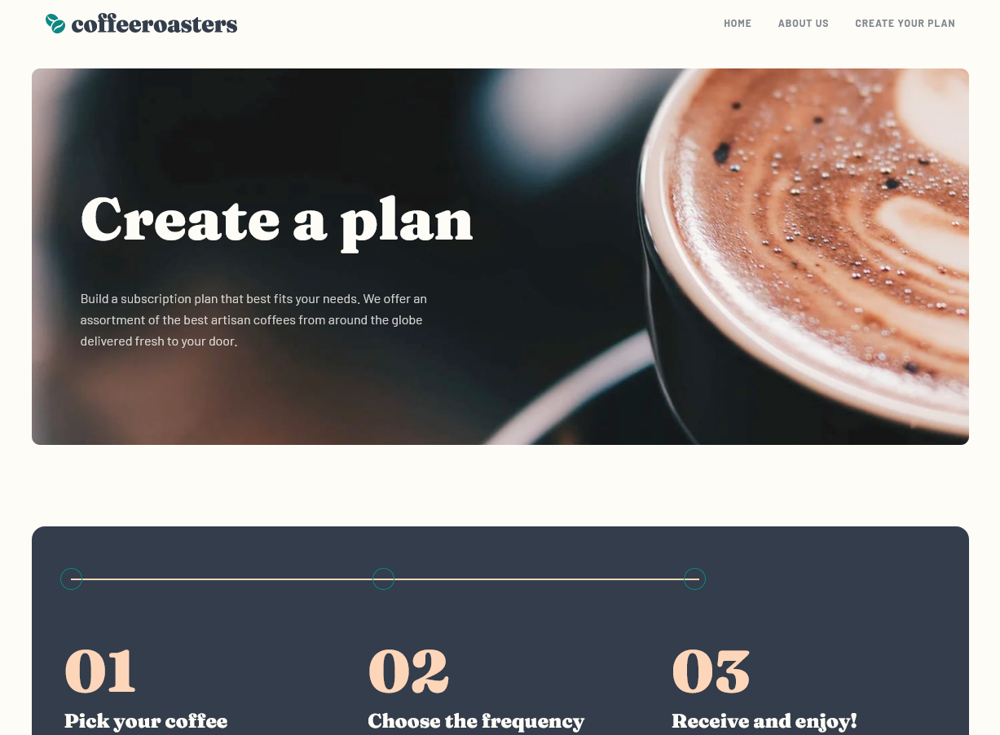

# Frontend Mentor - Coffeeroasters subscription site solution

This is a solution to the [Coffeeroasters subscription site challenge on Frontend Mentor](https://www.frontendmentor.io/challenges/coffeeroasters-subscription-site-5Fc26HVY6). Frontend Mentor challenges help you improve your coding skills by building realistic projects.

## Table of contents

- [Overview](#overview)
  - [The challenge](#the-challenge)
  - [Screenshot](#screenshot)
  - [Links](#links)
- [My process](#my-process)
  - [Built with](#built-with)
  - [What I learned](#what-i-learned)
  - [Continued development](#continued-development)
- [Author](#author)

## Overview

### The challenge

Users should be able to:

- View the optimal layout for each page depending on their device's screen size
- See hover states for all interactive elements throughout the site
- Make selections to create a coffee subscription and see an order summary modal of their choices

### Screenshot



### Links

- Solution URL: [Github](https://github.com/Joelynn94/coffeeroasters)
- Live Site URL: [Live](https://jl-coffeeroasters.netlify.app/)

## My process

### Built with

- Semantic HTML5 markup
- Sass (with partials)
- Flexbox
- CSS Grid
- JavaScript
- Mobile-first workflow

### What I learned

I was very happy with the plan section when choosing a coffee subscription. I decided to make an opject that contains the selections the user makes. This was also the first time I've ever made a radio button that looked completely different from the standard radio input. It took research and ran into many issues but I really like the result. I've provided two code snippets below.

```css
.options {
  display: grid;
  gap: 1rem;

  @media (min-width: $md-breakpoint) {
    grid-template-columns: repeat(3, 1fr);
  }

  input[type="radio"] {
    height: 0;
    width: 0;
    opacity: 0;
    &:not(:disabled) ~ label {
      cursor: pointer;
    }

    &:disabled ~ label {
      color: hsla(150, 5%, 75%, 1);
      border-color: hsla(150, 5%, 75%, 1);
      box-shadow: none;
      cursor: not-allowed;
    }
  }

  label {
    display: block;
    background-color: $dark-cream;
    color: $dark-grey-blue;
    border-radius: 1rem;
    padding: 1.5rem 1.5rem;

    @media (min-width: $md-breakpoint) {
      height: 8rem;
      padding: 3.5rem 1.5rem;
    }
  }

  input[type="radio"]:checked + label {
    background-color: $dark-cyan;
    color: $light-cream;
  }

  @media (min-width: $lg-breakpoint) {
    input[type="radio"]:hover + label {
      background-color: $pale-orange;
      color: $dark-grey-blue;
    }
  }
}
```

```js
function loopRadioBtns(arr, spanEl) {
  for (let i = 0; i < arr.length; i++) {
    const element = arr[i];

    // see if an element is checked
    if (element.checked) {
      spanEl.textContent = element.value;

      return (userOptions = {
        userPreference: dataPreference.textContent,
        userBeanType: dataBean.textContent,
        userQuantity: dataQuantity.textContent,
        userGrindOption: dataGrind.textContent,
        userDelivery: dataDelivery.textContent,
        userCost: `${element.dataset.price} / mo`,
      });
    }
  }
}
```

### Continued development

I want to continue to work on accessibility when creating custom elements. The web should be accessible to everyone. I am also looking for ways to cleanup my code.

## Author

- Website - [Joseph Lynn](https://www.josephlynn.com/)
- Frontend Mentor - [@Joelynn94](https://www.frontendmentor.io/profile/Joelynn94)
- Twitter - [@joe1ynn](https://twitter.com/joe1ynn)
